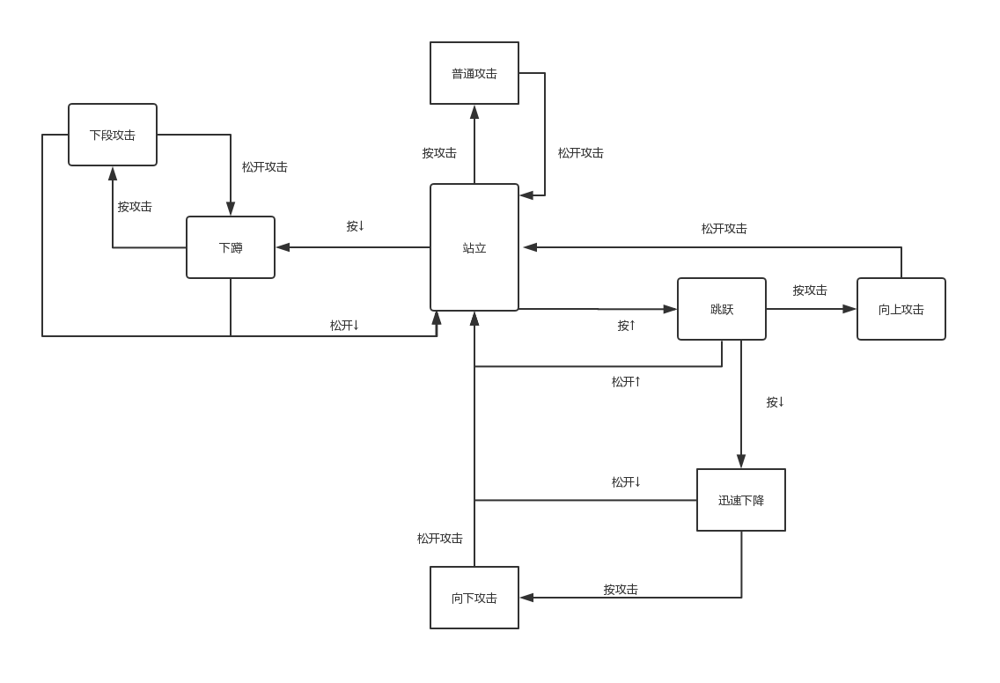
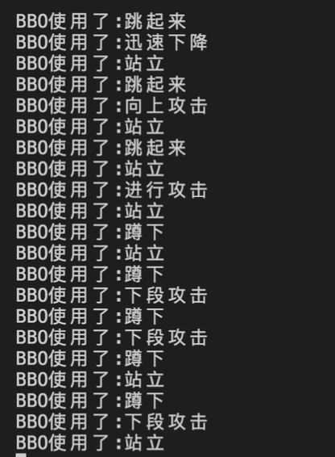

# FSM_DEMO
## 问题分析
假如我们现在正在玩任天堂的全明星大乱斗游戏。我们控制英雄，当按方向键↓时，下蹲，按↑时跳跃，通常我们编写程序时可以通过条件语句判断按下了哪个按键从而直接执行相应的操作，但是问题出现在如果我们在英雄执行某项操作时再按方向键，那么我们的英雄会处于一个半跳跃半下蹲的情况，当然这种情况我们可以通过设置标志位比如说如IsJumping  IsDucking来解决，但是当我们的操作变得更加复杂，代码的编写和调试变得混乱而不可维护。当然我们可以使用有限状态机(FSM)来解决这个问题，通过设定明确的状态和状态转换条件来明确有限个状态以及在这些状态之间的转移和动作，从而使得游戏设计变得简单清晰。

FSM的要点如下：

1.	拥有一组状态，并且可以在这组状态之间进行切换。在我们的例子中，是站立，跳跃，蹲下和跳斩。
2.	状态机同时只能在一个状态。英雄不可能同时处于跳跃和站立。事实上，防止这点是使用FSM的理由之一。
3.	一连串的输入或事件被发送给机器。在我们的例子中，就是按键按下和松开。
4.	每个状态都有一系列的转换，转换与输入和另一状态相关。如果输入在当前状态没有定义转换，输入就被忽视。当输入进来，如果它与当前状态的某个转换匹配，机器转为转换所指的状态。

目前而言，游戏编程中状态机的实现方式，有两种可以选择：

1.	用枚举配合switch case语句。
2.	用多态与虚函数（也就是状态模式）。

本文中涉及的模型较为简单，故通过方式一进行实现。

## 建模

图一中描述了任天堂全明星大乱斗游戏中的部分动作的状态转化流程，我们将FSM的每一个状态声明为一个枚举，这样我们就避免了使用一堆无需一堆flags，我们可以直接通过输入和state处于的状态来进行状态的转换。
## 实现
代码通过C++和OpenGL实现

## 参考资料
[1]http://gameprogrammingpatterns.com/state.html


